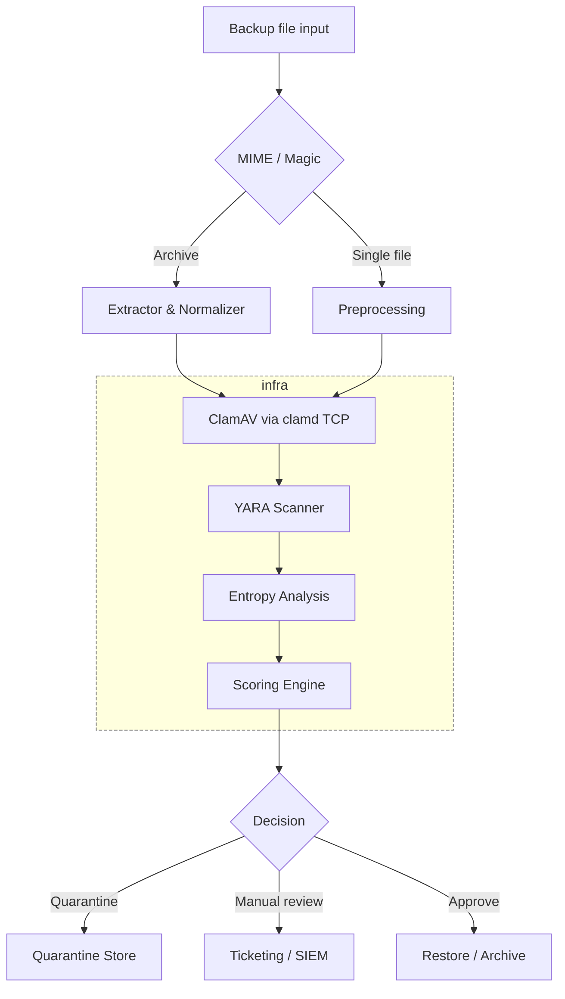

# BackupLens

A comprehensive backup file security scanning pipeline that analyzes files for malware, suspicious patterns, and anomalies before restoration or archival.

## Architecture



## Overview

BackupLens provides a multi-layered security scanning pipeline for backup files. It performs:

- **MIME Type Detection**: Identifies file types and detects mismatches
- **ClamAV Scanning**: Virus and malware detection via ClamAV (gracefully handles unavailability)
- **YARA Pattern Matching**: Custom rule-based threat detection
- **Entropy Analysis**: Detects encrypted or obfuscated content
- **Scoring Engine**: Risk-based decision making with configurable thresholds

**Resilient Design**: The pipeline continues operating even if individual scanning components (like ClamAV) are unavailable, ensuring maximum uptime and coverage.

## Project Structure

```
BackupLens/
├── services/              # Service implementations
│   ├── backuplens-pipeline/      # Go pipeline implementation
│   ├── yara-scanner/     # YARA scanner service (Go)
│   └── clamav-updater/   # ClamAV database updater service (Go)
├── tools/                 # Analysis and utility tools
│   └── analyze/          # Analysis tools
│       └── entropy-map.go  # Entropy analysis tool
├── config/               # Configuration files
│   └── scoring.yaml      # Scoring weights and thresholds
├── docker-compose.yml    # Docker Compose configuration
├── podman-compose.yml    # Podman Compose configuration
├── go.work               # Go workspace file (for multi-module development)
├── LICENSE               # MIT License
└── README.md             # Project documentation
```

## Services

### Pipeline Service

Go-based implementation (`services/backuplens-pipeline/`) using:
- `mimetype` for MIME type detection
- Direct TCP connection to ClamAV daemon (`clamd`) for virus scanning
- YARA scanner HTTP API for pattern matching
- Built-in entropy analysis
- **Concurrent processing**: Processes multiple files in parallel using a worker pool
- **Directory watching**: Automatically scans the incoming directory for new files
- **Configurable workers**: Set `NUM_WORKERS` environment variable (default: 5)
- **Local-first paths**: Automatically uses local directories (`./incoming`, `./quarantine`, `./config`) when running outside containers
- **Graceful degradation**: ClamAV scanning failures are non-fatal - pipeline continues with YARA and other checks if ClamAV is unavailable

### YARA Scanner

Standalone YARA scanning service written in Go that provides pattern matching capabilities via HTTP API. Loads rules from local directory at startup for offline operation.

**Default Port:** `8081` (configurable via `PORT` environment variable)

**Endpoints:**
- `GET /health` - Health check
- `POST /scan` - Scan uploaded file
- `POST /scan-file` - Scan file by path
- `POST /reload` - Reload YARA rules from directory

**Configuration:**
- `YARA_RULES_DIR`: Rules directory path (default: checks `./yara-rules` first, then `/rules`)
- `PORT`: Service port (default: `8081`)

### ClamAV Updater

Management service for updating ClamAV virus database. Provides HTTP API to trigger database updates. **Automatically detects and uses Podman or Docker.**

**Default Port:** `8082` (configurable via `PORT` environment variable)

**Endpoints:**
- `GET /health` - Health check
- `POST /update` - Trigger ClamAV database update

**Error Handling:**
The service provides intelligent error handling for common ClamAV update scenarios:
- **Rate Limiting (429)**: Returns appropriate status when ClamAV CDN rate limits requests
- **Outdated Version**: Detects and reports when ClamAV installation is outdated
- **Cooldown Periods**: Handles retry-after periods gracefully

### Supporting Services

- **ClamAV**: Virus scanning daemon (using official `clamav/clamav:latest` Alpine-based image)

## Configuration

Scoring weights and thresholds are configured in `config/scoring.yaml`:

- **Weights**: Risk scores for different detection types
  - `mime_mismatch`: 30
  - `clamav_infected`: 200
  - `yara_match`: 120
  - `high_entropy`: 40

- **Thresholds**: Decision boundaries
  - `auto_approve`: ≤ 50
  - `manual_review`: 51-100
  - `quarantine`: > 100

## Offline Operation

BackupLens is designed to operate **completely offline** without internet connectivity:

### ClamAV Offline Configuration

- **Database Persistence**: ClamAV virus definitions are stored in a Docker volume (`clamd-db`) that persists across container restarts
- **No Automatic Updates**: The database volume persists locally, no internet required after initial setup
- **Local Database Support**: Optionally mount pre-downloaded ClamAV database files (`.cvd` files) to `./clamav-db/` directory
- **Initial Database**: The Docker image includes a base virus database that works immediately

To update ClamAV database manually (when online):
```bash
docker exec clamav freshclam
```

### YARA Offline Configuration

- **Local Rules Only**: All YARA rules must be placed in the `./yara-rules/` directory
- **No Remote Fetching**: The YARA scanner loads rules only from the local mounted volume
- **Rule Format**: Place `.yar` or `.yara` files in `./yara-rules/` directory
- **Startup Loading**: Rules are compiled and loaded at service startup
- **Hot Reload**: Rules can be reloaded without restarting the service via HTTP API

## Updating Rules and Databases

### Updating YARA Rules

YARA rules can be updated in two ways:

1. **Add/Update Rules**: Place new or updated `.yar` or `.yara` files in `./yara-rules/` directory, then reload:
```bash
curl -X POST http://localhost:8081/reload
```

2. **Automatic Detection**: The YARA scanner service will detect new rules when you call the reload endpoint after adding files.

### Updating ClamAV Database

ClamAV database can be updated via the ClamAV Updater service:

```bash
# Trigger database update (requires internet connection)
curl -X POST http://localhost:8082/update
```

Or manually:
```bash
# With Docker
docker exec clamav freshclam

# With Podman
podman exec clamav freshclam
```

**Note**: The ClamAV updater service automatically detects and uses Podman or Docker. It requires container runtime socket access to execute updates. The database updates are stored in the persistent volume and will be available after container restarts.

**Important**: The service uses the official ClamAV image (`clamav/clamav:latest`) which provides up-to-date ClamAV versions. If you encounter rate limiting or version warnings, the service will return appropriate HTTP status codes with detailed error messages.

## Quick Start

### Option 1: Using Docker

**Prerequisites:**
- Docker and Docker Compose
- YARA rules directory (mount at `./yara-rules`)
- (Optional) Pre-downloaded ClamAV database files in `./clamav-db/`

**Running the Pipeline:**

1. Create required directories:
```bash
mkdir -p yara-rules incoming quarantine clamav-db
```

2. Place YARA rules in `./yara-rules/` directory (`.yar` or `.yara` files)
3. (Optional) Place ClamAV database files in `./clamav-db/` if you have pre-downloaded definitions
4. Start services:

```bash
docker-compose up -d
# Or using Makefile:
make docker-up
```

5. Place files to scan in `./incoming/` directory (the pipeline will automatically detect and process them)

6. Monitor logs:

```bash
docker-compose logs -f pipeline
# Or using Makefile:
make docker-logs
```

The pipeline runs continuously, scanning the incoming directory every 5 seconds for new files and processing them concurrently using a worker pool.

### Option 1b: Using Podman

**Prerequisites:**
- Podman and Podman Compose (or `podman` + `docker-compose`)
- YARA rules directory (mount at `./yara-rules`)
- (Optional) Pre-downloaded ClamAV database files in `./clamav-db/`

**Running the Pipeline:**

1. Create required directories:
```bash
mkdir -p yara-rules incoming quarantine clamav-db
```

2. Place YARA rules in `./yara-rules/` directory (`.yar` or `.yara` files)
3. (Optional) Place ClamAV database files in `./clamav-db/` if you have pre-downloaded definitions
4. Start services:

```bash
# Using podman-compose (if installed)
podman-compose -f podman-compose.yml up -d

# Or using docker-compose with Podman backend
COMPOSE_PROJECT_NAME=backuplens docker-compose -f podman-compose.yml up -d

# Or using Makefile:
make podman-up
```

5. Place files to scan in `./incoming/` directory (the pipeline will automatically detect and process them)

6. Monitor logs:

```bash
# Using podman-compose
podman-compose -f podman-compose.yml logs -f pipeline

# Or using Makefile:
make podman-logs
```

**Note:** The ClamAV updater service automatically detects and uses Podman when available, falling back to Docker if Podman is not found.

### Option 2: Building and Running Without Containers

See the [Building Without Docker](#building-without-docker) section for detailed instructions.

### Directory Structure

The pipeline expects the following directories:

- `./incoming/`: Input files to scan (files are moved to quarantine if needed)
- `./quarantine/`: Quarantined files (write)
- `./yara-rules/`: YARA rule files (writable, `.yar` or `.yara` format - can be updated and reloaded)
- `./clamav-db/`: (Optional) Pre-downloaded ClamAV database files (read-only)
- `./config/`: Configuration files (read-only)

### Configuration Options

The pipeline can be configured via environment variables:

- `NUM_WORKERS`: Number of concurrent workers (default: 5)
- `INCOMING_DIR`: Directory to watch for files (default: `./incoming` locally, `/incoming` in containers)
- `QUARANTINE_DIR`: Directory for quarantined files (default: `./quarantine` locally, `/quarantine` in containers)
- `SCORING_CONFIG`: Path to scoring configuration (default: checks `./config/scoring.yaml` first, then `/config/scoring.yaml`)
- `CLAMD_HOST`: ClamAV host (default: `localhost` locally, `clamav` in containers)
- `CLAMD_PORT`: ClamAV port (default: `3310`)
- `YARA_HOST`: YARA scanner host (default: `localhost` locally, `yara-scanner` in containers)
- `YARA_PORT`: YARA scanner port (default: `8081`)
- `PORT`: Service port for yara-scanner and clamav-updater (default: `8081` for yara-scanner, `8082` for clamav-updater)
- `YARA_RULES_DIR`: YARA rules directory (default: checks `./yara-rules` first, then `/rules`)

**Note**: All services use local-first path resolution when running outside containers, automatically falling back to container paths if local paths don't exist. This allows the same binaries to work both locally and in containers.

## Decision Flow

Files are processed through the pipeline and assigned a risk score:

1. **Auto-approve** (score ≤ 50): File passes all checks, safe to restore
2. **Manual review** (score 51-100): Requires human review before restoration
3. **Quarantine** (score > 100): High risk, automatically quarantined

## Building Without Docker

BackupLens can be built and run without Docker using standard Go tooling.

### Prerequisites

- Go 1.25.4 or later (Go 1.23+ required for dependencies)
- YARA library and development headers (for yara-scanner) - **CGO required**
- ClamAV (for backuplens-pipeline to connect to)
- Make (optional, for using Makefile)

**Note**: The yara-scanner service requires CGO to be enabled as it uses C bindings to the YARA library. This is automatically handled in the Dockerfile, but when building locally, ensure CGO is enabled.

**Install YARA:**
```bash
# macOS
brew install yara

# Ubuntu/Debian
sudo apt-get install libyara-dev yara

# Fedora/RHEL
sudo dnf install yara-devel
```

### Building

**Using Makefile (recommended):**
```bash
# Build all services and tools
make build

# Build specific service
make build-service SERVICE=backuplens-pipeline

# Build entropy map tool
make entropy-map

# Install to /usr/local/bin
make install

# See all available targets
make help
```

**Using build script:**
```bash
./build.sh
```

**Manual build:**
```bash
# Build backuplens-pipeline
cd services/backuplens-pipeline
go mod download
go build -o ../../bin/backuplens-pipeline .

# Build yara-scanner (requires CGO and YARA development libraries)
cd services/yara-scanner
go mod download
CGO_ENABLED=1 go build -o ../../bin/yara-scanner .

# Build clamav-updater
cd services/clamav-updater
go mod download
go build -o ../../bin/clamav-updater .

# Build entropy-map tool
cd tools/analyze
go mod download
go build -o ../../bin/entropy-map entropy-map.go
```

### Running Without Docker

1. **Start ClamAV** (if not already running):

**Option A: Using systemd (Linux with local ClamAV installation):**
```bash
sudo systemctl start clamav-daemon
```

**Option B: Using Docker/Podman container (mount directories for file access):**
```bash
# Stop existing container if running
podman stop clamav 2>/dev/null; podman rm clamav 2>/dev/null

# Start ClamAV with mounted directories so it can access files
podman run -d --name clamav -p 3310:3310 \
  -v $(pwd)/incoming:/incoming:ro \
  -v $(pwd)/quarantine:/quarantine:ro \
  clamav/clamav:latest

# Or with Docker:
docker run -d --name clamav -p 3310:3310 \
  -v $(pwd)/incoming:/incoming:ro \
  -v $(pwd)/quarantine:/quarantine:ro \
  clamav/clamav:latest
```

**Note:** If ClamAV cannot access files (e.g., directories not mounted), ClamAV scanning will be skipped with a warning, but the pipeline will continue with YARA and other security checks.

2. **Start YARA Scanner:**
```bash
# Defaults to ./yara-rules directory
./bin/yara-scanner

# Or with custom config:
YARA_RULES_DIR=./my-rules PORT=8083 ./bin/yara-scanner
```

3. **Start Pipeline:**
```bash
# Defaults to localhost:3310 for ClamAV and localhost:8081 for YARA
# Make sure ClamAV and YARA scanner are running on localhost first
# Note: If ClamAV can't access files, it will log warnings but continue scanning
./bin/backuplens-pipeline

# Or with custom config:
INCOMING_DIR=./input QUARANTINE_DIR=./quarantined SCORING_CONFIG=./my-config.yaml \
  CLAMD_HOST=localhost YARA_HOST=localhost ./bin/backuplens-pipeline
```

**Important for Local Development:**
- If using ClamAV in a container, ensure directories are mounted (see step 1 above)
- ClamAV scanning errors are non-fatal - the pipeline will continue with YARA and entropy checks
- YARA scanner must be running for YARA pattern matching to work

4. **Start ClamAV Updater** (optional):
```bash
./bin/clamav-updater
```

### Build Output

All binaries are built to the `./bin/` directory:
- `./bin/backuplens-pipeline` - Main scanning pipeline
- `./bin/yara-scanner` - YARA scanning service
- `./bin/clamav-updater` - ClamAV database updater
- `./bin/entropy-map` - Entropy analysis tool

### Analysis Tools

**Entropy Map** (`./bin/entropy-map`):
A standalone tool for analyzing file entropy to help understand and tune entropy thresholds.

**Features:**
- Uses MIME type detection (same library as pipeline) for accurate file type identification
- Analyzes text files line-by-line and binary files in 1KB blocks
- Generates entropy distribution histograms
- Suggests optimal thresholds based on file type
- Shows how many samples would be flagged by the pipeline's threshold (6.5)
- Supports JSON output for programmatic processing

**Usage:**
```bash
# Build the tool
make entropy-map

# Analyze one or more files (text output)
./bin/entropy-map <file1> [file2] [file3]...

# Analyze with JSON output
./bin/entropy-map --json <file1> [file2] [file3]...

# Examples
./bin/entropy-map ./incoming/sample.txt ./incoming/binary.dat
./bin/entropy-map --json config/scoring.yaml
```

**Text Output includes:**
- Detected MIME type
- File type classification (Text/Binary)
- Entropy statistics (min, max, median, mean)
- Distribution histogram (ASCII visualization)
- Suggested threshold for anomaly detection
- Count of samples above pipeline threshold (6.5)

**JSON Output includes:**
- All text output data in structured JSON format
- Histogram data as structured bins with ranges and counts
- Pipeline threshold analysis with percentages
- Suitable for integration with other tools or scripts

## Development

### Building with Docker

```bash
# Go pipeline
cd services/backuplens-pipeline
docker build -t backuplens-pipeline .

# YARA scanner
cd services/yara-scanner
docker build -t yara-scanner .

# ClamAV updater
cd services/clamav-updater
docker build -t clamav-updater .
```

### Building with Podman

```bash
# Go pipeline
cd services/backuplens-pipeline
podman build -t backuplens-pipeline .

# YARA scanner
cd services/yara-scanner
podman build -t yara-scanner .

# ClamAV updater
cd services/clamav-updater
podman build -t clamav-updater .
```

**Note:** All Docker commands work with Podman as Podman is CLI-compatible with Docker. Simply replace `docker` with `podman` in any command.

## License

This project is licensed under the MIT License - see the [LICENSE](LICENSE) file for details.
