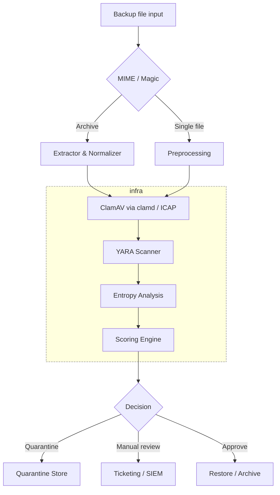

# BackupLens

A comprehensive backup file security scanning pipeline that analyzes files for malware, suspicious patterns, and anomalies before restoration or archival.

## Architecture



## Overview

BackupLens provides a multi-layered security scanning pipeline for backup files. It performs:

- **MIME Type Detection**: Identifies file types and detects mismatches
- **ClamAV Scanning**: Virus and malware detection via ClamAV
- **YARA Pattern Matching**: Custom rule-based threat detection
- **Entropy Analysis**: Detects encrypted or obfuscated content
- **Scoring Engine**: Risk-based decision making with configurable thresholds

## Project Structure

```
BackupLens/
├── services/              # Service implementations
│   ├── pipeline-go/      # Go pipeline implementation
│   └── yara-scanner/     # YARA scanner service (Go)
├── config/               # Configuration files
│   └── scoring.yaml      # Scoring weights and thresholds
├── docker-compose.yml    # Docker Compose configuration
├── podman-compose.yml    # Podman Compose configuration
├── LICENSE               # MIT License
└── README.md             # Project documentation
```

## Services

### Pipeline Service

Go-based implementation (`services/pipeline-go/`) using:
- `mimetype` for MIME type detection
- `go-clamd` for ClamAV integration
- YARA scanner HTTP API for pattern matching
- Built-in entropy analysis
- **Concurrent processing**: Processes multiple files in parallel using a worker pool
- **Directory watching**: Automatically scans the incoming directory for new files
- **Configurable workers**: Set `NUM_WORKERS` environment variable (default: 5)

### YARA Scanner

Standalone YARA scanning service written in Go that provides pattern matching capabilities via HTTP API. Loads rules from local directory at startup for offline operation.

**Endpoints:**
- `GET /health` - Health check
- `POST /scan` - Scan uploaded file
- `POST /scan-file` - Scan file by path
- `POST /reload` - Reload YARA rules from directory

### ClamAV Updater

Management service for updating ClamAV virus database. Provides HTTP API to trigger database updates. **Automatically detects and uses Podman or Docker.**

**Endpoints:**
- `GET /health` - Health check
- `POST /update` - Trigger ClamAV database update

### Supporting Services

- **ClamAV**: Virus scanning daemon
- **c-icap**: ICAP protocol server for ClamAV integration

## Configuration

Scoring weights and thresholds are configured in `config/scoring.yaml`:

- **Weights**: Risk scores for different detection types
  - `mime_mismatch`: 30
  - `clamav_infected`: 200
  - `yara_match`: 120
  - `high_entropy`: 40

- **Thresholds**: Decision boundaries
  - `auto_approve`: ≤ 50
  - `manual_review`: 51-100
  - `quarantine`: > 100

## Offline Operation

BackupLens is designed to operate **completely offline** without internet connectivity:

### ClamAV Offline Configuration

- **Database Persistence**: ClamAV virus definitions are stored in a Docker volume (`clamd-db`) that persists across container restarts
- **No Automatic Updates**: The database volume persists locally, no internet required after initial setup
- **Local Database Support**: Optionally mount pre-downloaded ClamAV database files (`.cvd` files) to `./clamav-db/` directory
- **Initial Database**: The Docker image includes a base virus database that works immediately

To update ClamAV database manually (when online):
```bash
docker exec clamav freshclam
```

### YARA Offline Configuration

- **Local Rules Only**: All YARA rules must be placed in the `./yara-rules/` directory
- **No Remote Fetching**: The YARA scanner loads rules only from the local mounted volume
- **Rule Format**: Place `.yar` or `.yara` files in `./yara-rules/` directory
- **Startup Loading**: Rules are compiled and loaded at service startup
- **Hot Reload**: Rules can be reloaded without restarting the service via HTTP API

## Updating Rules and Databases

### Updating YARA Rules

YARA rules can be updated in two ways:

1. **Add/Update Rules**: Place new or updated `.yar` or `.yara` files in `./yara-rules/` directory, then reload:
```bash
curl -X POST http://localhost:8081/reload
```

2. **Automatic Detection**: The YARA scanner service will detect new rules when you call the reload endpoint after adding files.

### Updating ClamAV Database

ClamAV database can be updated via the ClamAV Updater service:

```bash
# Trigger database update (requires internet connection)
curl -X POST http://localhost:8082/update
```

Or manually:
```bash
# With Docker
docker exec clamav freshclam

# With Podman
podman exec clamav freshclam
```

**Note**: The ClamAV updater service automatically detects and uses Podman or Docker. It requires container runtime socket access to execute updates. The database updates are stored in the persistent volume and will be available after container restarts.

## Quick Start

### Option 1: Using Docker

**Prerequisites:**
- Docker and Docker Compose
- YARA rules directory (mount at `./yara-rules`)
- (Optional) Pre-downloaded ClamAV database files in `./clamav-db/`

**Running the Pipeline:**

1. Create required directories:
```bash
mkdir -p yara-rules incoming quarantine clamav-db
```

2. Place YARA rules in `./yara-rules/` directory (`.yar` or `.yara` files)
3. (Optional) Place ClamAV database files in `./clamav-db/` if you have pre-downloaded definitions
4. Start services:

```bash
docker-compose up -d
# Or using Makefile:
make docker-up
```

5. Place files to scan in `./incoming/` directory (the pipeline will automatically detect and process them)

6. Monitor logs:

```bash
docker-compose logs -f pipeline
# Or using Makefile:
make docker-logs
```

The pipeline runs continuously, scanning the incoming directory every 5 seconds for new files and processing them concurrently using a worker pool.

### Option 1b: Using Podman

**Prerequisites:**
- Podman and Podman Compose (or `podman` + `docker-compose`)
- YARA rules directory (mount at `./yara-rules`)
- (Optional) Pre-downloaded ClamAV database files in `./clamav-db/`

**Running the Pipeline:**

1. Create required directories:
```bash
mkdir -p yara-rules incoming quarantine clamav-db
```

2. Place YARA rules in `./yara-rules/` directory (`.yar` or `.yara` files)
3. (Optional) Place ClamAV database files in `./clamav-db/` if you have pre-downloaded definitions
4. Start services:

```bash
# Using podman-compose (if installed)
podman-compose -f podman-compose.yml up -d

# Or using docker-compose with Podman backend
COMPOSE_PROJECT_NAME=backuplens docker-compose -f podman-compose.yml up -d

# Or using Makefile:
make podman-up
```

5. Place files to scan in `./incoming/` directory (the pipeline will automatically detect and process them)

6. Monitor logs:

```bash
# Using podman-compose
podman-compose -f podman-compose.yml logs -f pipeline

# Or using Makefile:
make podman-logs
```

**Note:** The ClamAV updater service automatically detects and uses Podman when available, falling back to Docker if Podman is not found.

### Option 2: Building and Running Without Containers

See the [Building Without Docker](#building-without-docker) section for detailed instructions.

### Directory Structure

The pipeline expects the following directories:

- `./incoming/`: Input files to scan (files are moved to quarantine if needed)
- `./quarantine/`: Quarantined files (write)
- `./yara-rules/`: YARA rule files (writable, `.yar` or `.yara` format - can be updated and reloaded)
- `./clamav-db/`: (Optional) Pre-downloaded ClamAV database files (read-only)
- `./config/`: Configuration files (read-only)

### Configuration Options

The pipeline can be configured via environment variables:

- `NUM_WORKERS`: Number of concurrent workers (default: 5)
- `INCOMING_DIR`: Directory to watch for files (default: `/incoming`)
- `QUARANTINE_DIR`: Directory for quarantined files (default: `/quarantine`)
- `SCORING_CONFIG`: Path to scoring configuration (default: `/config/scoring.yaml`)
- `CLAMD_HOST`: ClamAV host (default: `clamav`)
- `CLAMD_PORT`: ClamAV port (default: `3310`)
- `YARA_HOST`: YARA scanner host (default: `yara-scanner`)
- `YARA_PORT`: YARA scanner port (default: `8081`)

## Decision Flow

Files are processed through the pipeline and assigned a risk score:

1. **Auto-approve** (score ≤ 50): File passes all checks, safe to restore
2. **Manual review** (score 51-100): Requires human review before restoration
3. **Quarantine** (score > 100): High risk, automatically quarantined

## Building Without Docker

BackupLens can be built and run without Docker using standard Go tooling.

### Prerequisites

- Go 1.21 or later
- YARA library and development headers (for yara-scanner)
- ClamAV (for pipeline-go to connect to)
- Make (optional, for using Makefile)

**Install YARA:**
```bash
# macOS
brew install yara

# Ubuntu/Debian
sudo apt-get install libyara-dev yara

# Fedora/RHEL
sudo dnf install yara-devel
```

### Building

**Using Makefile (recommended):**
```bash
# Build all services
make build

# Build specific service
make build-service SERVICE=pipeline-go

# Install to /usr/local/bin
make install

# See all available targets
make help
```

**Using build script:**
```bash
./build.sh
```

**Manual build:**
```bash
# Build pipeline-go
cd services/pipeline-go
go mod download
go build -o ../../bin/pipeline-go .

# Build yara-scanner
cd services/yara-scanner
go mod download
go build -o ../../bin/yara-scanner .

# Build clamav-updater
cd services/clamav-updater
go mod download
go build -o ../../bin/clamav-updater .
```

### Running Without Docker

1. **Start ClamAV** (if not already running):
```bash
# Using systemd
sudo systemctl start clamav-daemon

# Or using Docker (if you have Docker but want to run services natively)
docker run -d --name clamav -p 3310:3310 mkodockx/docker-clamav:alpine

# Or using Podman
podman run -d --name clamav -p 3310:3310 mkodockx/docker-clamav:alpine
```

2. **Start YARA Scanner:**
```bash
./bin/yara-scanner
# Or with custom config:
YARA_RULES_DIR=./yara-rules ./bin/yara-scanner
```

3. **Start Pipeline:**
```bash
./bin/pipeline-go
# Or with custom config:
INCOMING_DIR=./incoming QUARANTINE_DIR=./quarantine ./bin/pipeline-go
```

4. **Start ClamAV Updater** (optional):
```bash
./bin/clamav-updater
```

### Build Output

All binaries are built to the `./bin/` directory:
- `./bin/pipeline-go` - Main scanning pipeline
- `./bin/yara-scanner` - YARA scanning service
- `./bin/clamav-updater` - ClamAV database updater

## Development

### Building with Docker

```bash
# Go pipeline
cd services/pipeline-go
docker build -t backup-pipeline-go .

# YARA scanner
cd services/yara-scanner
docker build -t yara-scanner .

# ClamAV updater
cd services/clamav-updater
docker build -t clamav-updater .
```

### Building with Podman

```bash
# Go pipeline
cd services/pipeline-go
podman build -t backup-pipeline-go .

# YARA scanner
cd services/yara-scanner
podman build -t yara-scanner .

# ClamAV updater
cd services/clamav-updater
podman build -t clamav-updater .
```

**Note:** All Docker commands work with Podman as Podman is CLI-compatible with Docker. Simply replace `docker` with `podman` in any command.

## License

This project is licensed under the MIT License - see the [LICENSE](LICENSE) file for details.
